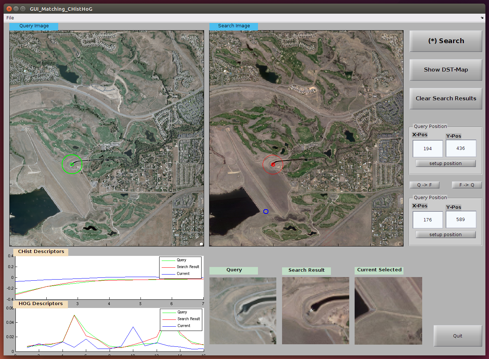

# CHistHoG_Matlab
==========================

Simple MATLAB demo Template Matching
scheme based on CHistHOG () descriptor.

CHistHOG descriptor:
Circular Histogram (of gradients) + HoG (Histogram of Gradient orientation).

==========================

